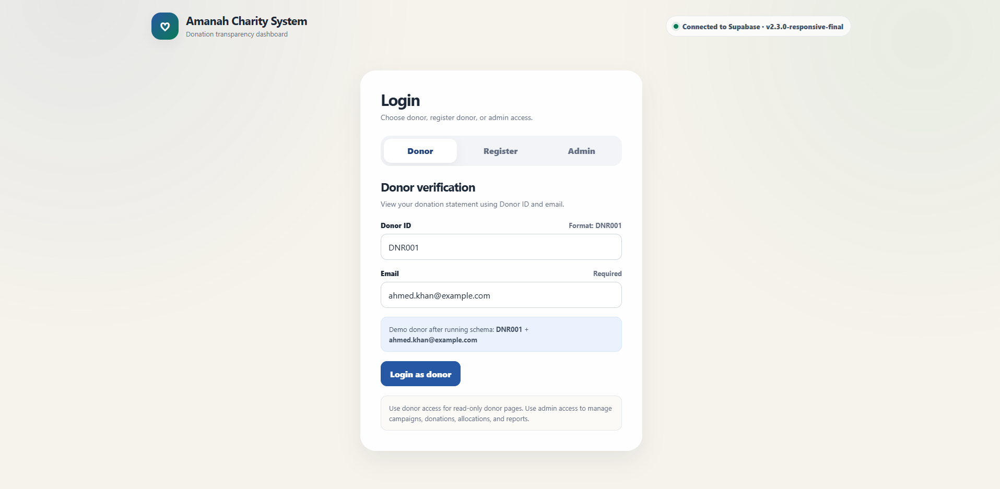
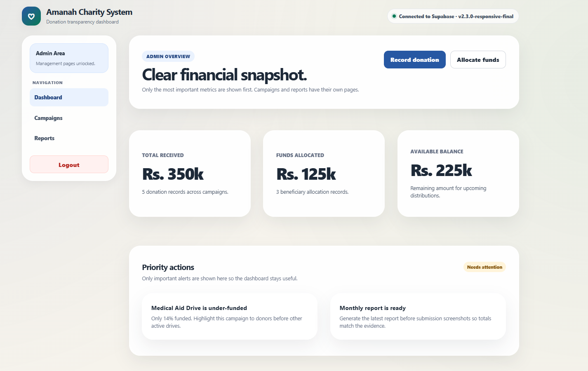
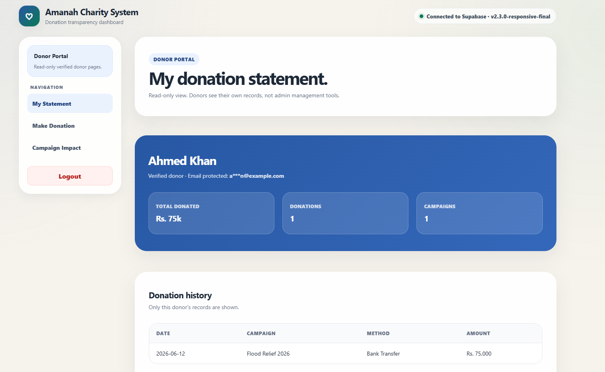
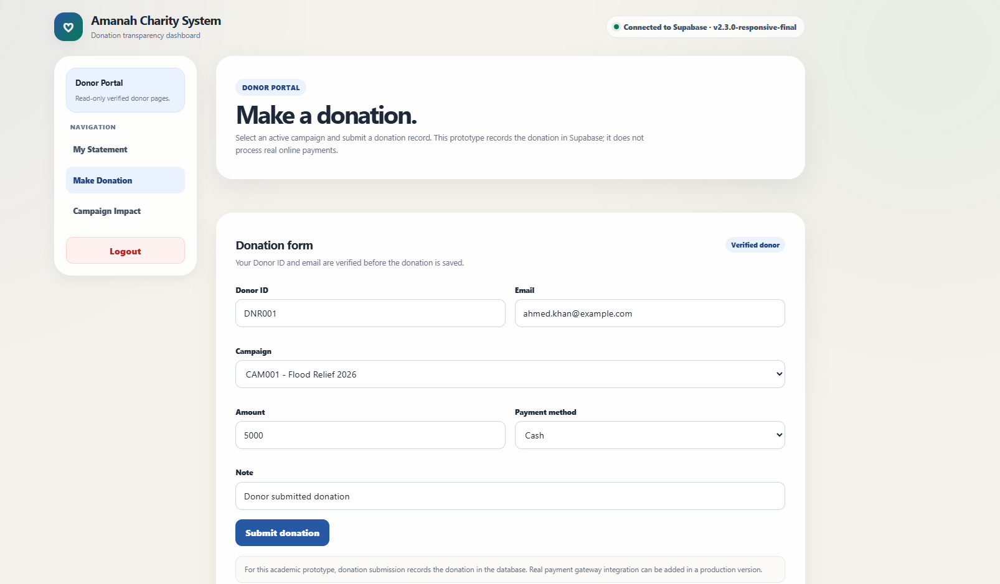
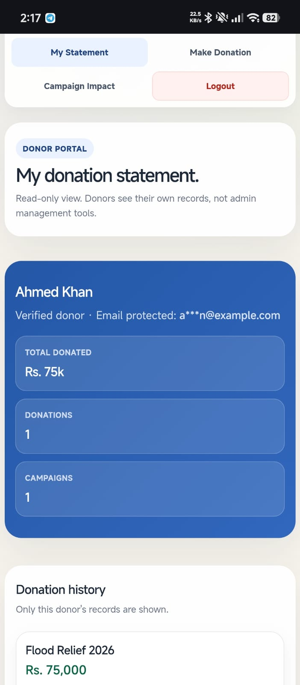
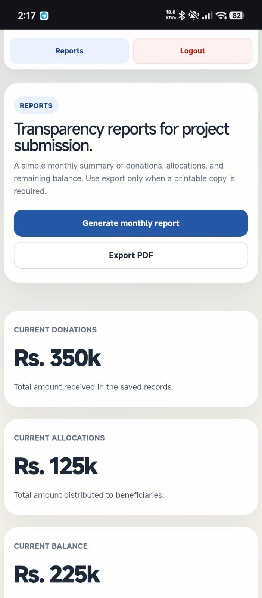
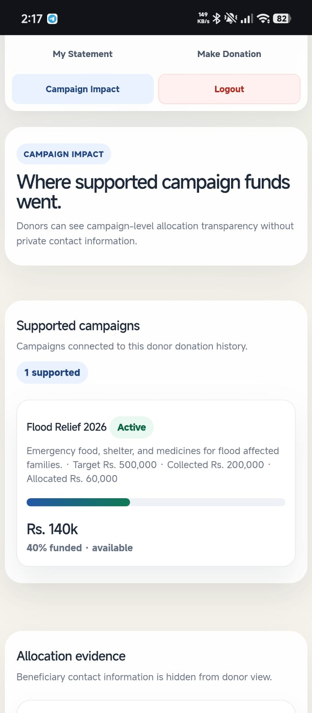
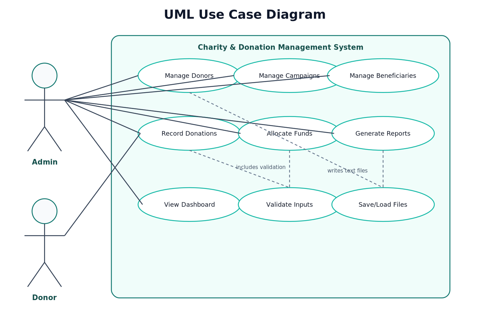
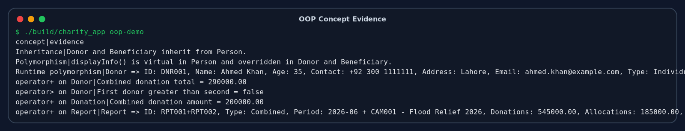
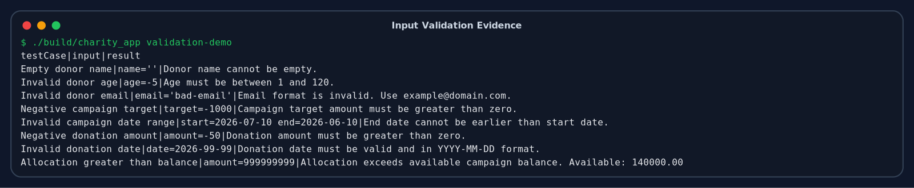

# Charity & Donation Management System

## Second Semester OOP Project Report

**Course:** Object Oriented Programming  
**Semester:** Second Semester  
**University/College:** Air University  
**Department:** [Department Name]  
**Section:** [Section]  
**Instructor:** Miss Muneeba  
**Submission Date:** 22 June 2026

**Submitted By:**

| Student Name | Roll Number / ID |
|---|---|
| Ali Raza | 2540010 |
| Muhammad Ammar | 2540004 |
| Taha Ali | 2540008 |

---

## Table of Contents

1. Introduction  
2. Problem Definition  
3. Project Objectives  
4. Proposed Solution  
5. System Modules  
6. OOP Design and Class Structure  
7. Data Management  
8. User Interface and Web Dashboard  
9. Responsive Design Improvements  
10. Testing and Validation  
11. Screenshots and Demonstration Evidence  
12. Challenges Faced  
13. Future Enhancements  
14. Conclusion  
15. Appendix: How to Run the Project  

---

## 1. Introduction

The **Charity & Donation Management System** is a second semester Object Oriented Programming project. The project was built to manage charity campaigns, donors, beneficiaries, donations, fund allocations, and reports in a clear and organized way.

The main idea is simple: when people donate money to a charity, they should be able to see where their donation went. At the same time, the charity admin should have a proper system to record donations, create campaigns, allocate funds, and prepare transparent reports.

This project has two connected parts:

1. **C++ OOP Core**  
   This is the main programming part for the course. It contains classes, inheritance, polymorphism, constructors, operator overloading, file handling, validation, and report generation.

2. **Vercel + Supabase Web Dashboard**  
   This is the hosted interface of the system. It uses a browser-based frontend with Supabase database support. It makes the project easier to demonstrate because donors and admins can use the system through a web app.

The web dashboard does not replace the C++ project. The C++ core is the academic OOP implementation, and the web dashboard is the practical interface built around the same project idea.

---

## 2. Problem Definition

Many small charity organizations manage donations using notebooks, spreadsheets, or scattered records. This creates several problems:

- Donation records can be lost or duplicated.
- Donors cannot easily check their own donation history.
- Campaign progress is not always clear.
- Fund allocation to beneficiaries can become difficult to track.
- Reports take time to prepare manually.
- There is less transparency between donors and the charity team.

The problem is meaningful because charity work depends heavily on trust. If donors cannot see how funds are collected and distributed, they may hesitate to donate again. A proper management system can make the process more reliable and transparent.

---

## 3. Project Objectives

The main objectives of this project are:

- To design a proper OOP-based charity management system in C++.
- To manage donors, campaigns, beneficiaries, donations, allocations, and reports.
- To apply important OOP concepts such as inheritance, polymorphism, encapsulation, constructors, and operator overloading.
- To store and read data using file handling in the C++ core.
- To add validation so incorrect data is not accepted.
- To provide a donor portal where donors can view their own statement and campaign impact.
- To provide an admin dashboard for managing campaigns, donations, allocations, and reports.
- To improve the user interface so it works on desktop and mobile screens.

---

## 4. Proposed Solution

The proposed solution is a hybrid project:

### 4.1 C++ OOP Core

The C++ part is the foundation of the project. It contains all major classes and logic required for an OOP course project. The C++ program stores sample data in text files and provides commands to test different features.

### 4.2 Hosted Web Dashboard

The web dashboard is hosted using Vercel and uses Supabase as the database. This makes the project more useful because it allows real data to be stored online. Admins can log in, donors can verify themselves, and reports can be generated from saved records.

This approach was selected because it keeps the academic OOP requirements in C++ while also giving the project a professional and easy-to-use interface.


### 4.3 Project Links

The final hosted web application and source repository are:

| Item | Link |
|---|---|
| Hosted Web App | https://charity-donation-management-system-ruddy.vercel.app/ |
| GitHub Repository | https://github.com/muhammadammarff-design/Charity-Donation-Management-System |

---

## 5. System Modules

### 5.1 Donor Module

The donor module manages donor details such as donor name, age, contact, email, address, donor type, and total donated amount.

Main donor features:

- Register donor
- Generate donor ID
- Verify donor using donor ID and email
- View donor statement
- View donation history
- View campaign impact
- Submit a donation record through the web dashboard

### 5.2 Campaign Module

The campaign module manages charity campaigns. Each campaign has a title, description, target amount, collected amount, allocated amount, start date, end date, and status.

Main campaign features:

- Create campaign
- Track collected amount
- Track allocated amount
- Show available balance
- Show campaign progress
- Filter active campaigns

### 5.3 Beneficiary Module

The beneficiary module keeps records of people or families receiving support from charity campaigns.

Main beneficiary features:

- Add beneficiary information
- Link beneficiary with a campaign
- Track total amount received
- Store need type and family size

### 5.4 Donation Module

The donation module records donor contributions.

Main donation features:

- Record donation amount
- Save payment method
- Link donation with donor and campaign
- Update donor total
- Update campaign collected amount

### 5.5 Fund Allocation Module

The allocation module records how funds are distributed to beneficiaries.

Main allocation features:

- Allocate funds to beneficiaries
- Prevent allocation above available campaign balance
- Update beneficiary total received
- Update campaign allocated amount
- Save purpose and approval information

### 5.6 Reports Module

The reports module generates summary records for donations, allocations, and remaining balance.

Main report features:

- Generate monthly report
- Show total donations
- Show total allocations
- Show remaining balance
- Export or print report from the browser

---

## 6. OOP Design and Class Structure

The C++ core is designed using meaningful classes. Each class has its own responsibility, which makes the system easier to understand and maintain.

### 6.1 Main Classes

| Class | Purpose |
|---|---|
| `Person` | Base class for common person information |
| `Donor` | Stores donor details and donation-related behavior |
| `Beneficiary` | Stores beneficiary details and support information |
| `Campaign` | Manages campaign details, target amount, collected amount, and allocated amount |
| `Donation` | Stores donation transaction details |
| `FundAllocation` | Stores fund distribution details |
| `Report` | Generates and stores report information |
| `FileManager` | Handles file reading and writing |
| `CharitySystem` | Main controller class that connects all modules |
| `Validation` | Validates input values before saving or processing |

### 6.2 Encapsulation

Encapsulation is used by keeping data members private or protected and accessing them through methods. This protects the internal data of the class and avoids direct unwanted changes.

Example areas where encapsulation is used:

- Donor personal information
- Campaign amount values
- Donation transaction data
- Beneficiary records

### 6.3 Inheritance

Inheritance is used through the `Person` base class. Both `Donor` and `Beneficiary` are types of people, so they share common information such as name, age, and contact.

`Donor` and `Beneficiary` inherit from `Person`, which avoids repeated code and shows a proper class relationship.

### 6.4 Polymorphism

Polymorphism is used through virtual functions. The base class `Person` contains a virtual display function, and derived classes provide their own version of the function.

This allows the program to treat different person objects in a common way while still showing their specific details.

### 6.5 Constructors

The project uses constructors to initialize objects properly. Default and parameterized constructors are used in different classes to create objects with valid starting values.

### 6.6 Operator Overloading

Operator overloading is used to compare or combine meaningful project objects. It helps demonstrate advanced OOP concepts in a practical way instead of only writing basic classes.

### 6.7 Object Relationships

The system also shows relationships between objects:

- A donor can make many donations.
- A campaign can receive many donations.
- A campaign can support many beneficiaries.
- A beneficiary can receive allocations.
- Reports summarize donations and allocations.

---

## 7. Data Management

### 7.1 C++ File Handling

The C++ core uses text files stored in the `data/` folder. This satisfies the file handling requirement and keeps local sample records for testing.

Important files include:

| File | Purpose |
|---|---|
| `data/donors.txt` | Stores donor records |
| `data/campaigns.txt` | Stores campaign records |
| `data/beneficiaries.txt` | Stores beneficiary records |
| `data/donations.txt` | Stores donation records |
| `data/allocations.txt` | Stores fund allocation records |
| `data/reports.txt` | Stores report records |

### 7.2 Supabase Database

The web dashboard uses Supabase PostgreSQL for online data storage. Supabase stores the same type of project records in database tables.

Main Supabase tables:

- `donors`
- `campaigns`
- `beneficiaries`
- `donations`
- `allocations`
- `reports`
- `profiles`

The database also includes validation rules, triggers, and functions. For example, when a donation is inserted, campaign and donor totals are updated automatically. When an allocation is inserted, the database checks that the allocation does not exceed the available campaign balance.

---

## 8. User Interface and Web Dashboard

The hosted dashboard has two main user areas.

### 8.1 Donor Portal

The donor portal is for verified donors. A donor logs in using donor ID and email. After login, the donor can view:

- My Statement
- Make Donation
- Campaign Impact

The donor statement shows total donated amount, number of donations, supported campaigns, and donation history. The campaign impact page shows supported campaigns and allocation evidence related to those campaigns.

### 8.2 Admin Area

The admin area is for management work. The admin can view:

- Dashboard
- Campaigns
- Reports

The dashboard shows financial summary, campaign progress, and recent activity. The campaigns page allows campaign creation and filtering. The reports page shows generated reports and supports browser export/print.

---

## 9. Responsive Design Improvements

During final checking, some pages were not working smoothly on small screens. The main affected pages were:

- Donor **My Statement** page
- Donor **Campaign Impact** page
- Admin **Reports** page

The problems were mostly related to mobile layout, long buttons, table width, and the logout button not staying inside the visible page area.

The following improvements were made:

- The side navigation now changes into a clean mobile grid.
- The logout button stays inside the navigation area on mobile screens.
- The separate mobile logout bar was removed to avoid overflow and duplication.
- Buttons now wrap properly and become full width on smaller screens.
- The reports page was simplified and redesigned for mobile view.
- Report records now appear as mobile cards on small screens instead of forcing a wide table.
- Donor donation history also appears as mobile cards on small screens.
- Campaign impact allocation evidence also appears as mobile cards on small screens.
- Desktop tables are still available on larger screens.
- CSS breakpoints were cleaned and aligned for tablet and mobile layouts.
- Extra horizontal overflow was reduced through better grid, flex, and width rules.

This makes the project easier to use on phones while keeping the desktop layout professional.

---

## 10. Testing and Validation

Testing was done for both the C++ core and the web project.

### 10.1 C++ Core Testing

The C++ test script was executed successfully:

```bash
python3 tests/run_core_tests.py
```

Result:

```text
All C++ core tests passed.
```

The C++ tests check important features such as object creation, validation, donor statement generation, allocation rules, and basic system commands.

### 10.2 Web Build Testing

The web project was built successfully using:

```bash
npm run build
```

The build completed without JavaScript or CSS compilation errors.

### 10.3 Static Web Checks

The static web test file was also executed:

```bash
node tests/web_static_tests.mjs
```

Result:

```text
Web static crash tests passed.
```

### 10.4 Validation Examples

Validation is included in both the C++ core and the database layer.

Examples:

- Donation amount must be greater than zero.
- Age must be within a valid range.
- Contact number must have a valid length.
- Campaign target amount must be positive.
- Allocation cannot exceed available campaign balance.
- Beneficiary must be linked to the same campaign before allocation.
- Donor login requires correct donor ID and email.


### 10.5 Rubric Alignment

The project was checked against the given OOP project rubric. The system clearly defines a real problem, uses multiple meaningful classes, provides working features with validation, stores data through file/database handling, and includes UML, screenshots, and evidence for explanation.

| Rubric Area | How This Project Covers It |
|---|---|
| Problem Definition and Solution Design | Solves a practical charity transparency problem with donor, campaign, allocation, and report tracking. |
| OOP Design and Class Structure | Uses meaningful C++ classes with encapsulation, inheritance, polymorphism, constructors, operator overloading, and object relationships. |
| Functionality and Validation | Supports donor records, campaigns, donations, fund allocations, donor statements, campaign impact, and report generation with validation. |
| Data Management and Interface | Uses C++ text-file handling for the OOP core and Supabase PostgreSQL for the hosted dashboard. |
| Documentation and UML | Includes this project report, class diagram, use case diagram, evidence files, and screenshots. |
| Understanding of Concepts | The code structure and evidence commands make it possible to clearly explain the project and OOP implementation. |

---


## 11. Screenshots and Demonstration Evidence

The following screenshots were taken from the final hosted Vercel application after the responsive fixes. Desktop screenshots are used for the main dashboard and form views, while mobile screenshots are used to prove that the problem pages now work properly on phones.

### 11.1 Desktop Screenshots

<figure class="wide">
  
  <figcaption>Figure 1: Login page with donor, register, and admin access tabs.</figcaption>
</figure>

<figure class="wide">
  
  <figcaption>Figure 2: Admin dashboard showing financial summary, priority actions, and management controls.</figcaption>
</figure>

<figure class="wide">
  
  <figcaption>Figure 3: Donor statement desktop view showing total donations, campaign count, and donation history.</figcaption>
</figure>

<figure class="wide">
  
  <figcaption>Figure 4: Donor make donation page with verified donor details and active campaign selection.</figcaption>
</figure>

### 11.2 Mobile Responsive Screenshots

<figure class="phone">
  
  <figcaption>Figure 5: Mobile view of the donor My Statement page after the responsive rebuild.</figcaption>
</figure>

<figure class="phone">
  
  <figcaption>Figure 6: Mobile view of the admin Reports page with full-width buttons and stacked summary cards.</figcaption>
</figure>

<figure class="phone">
  
  <figcaption>Figure 7: Mobile view of Campaign Impact showing supported campaigns and allocation evidence.</figcaption>
</figure>

### 11.3 UML and C++ Evidence

<figure class="wide diagram">
  
  <figcaption>Figure 8: UML class diagram showing the main OOP class structure.</figcaption>
</figure>

<figure class="wide diagram">
  
  <figcaption>Figure 9: Use case diagram showing donor and admin interaction with the system.</figcaption>
</figure>

<figure class="wide evidence">
  
  <figcaption>Figure 10: C++ OOP evidence output showing class behavior and object-oriented implementation.</figcaption>
</figure>

<figure class="wide evidence">
  
  <figcaption>Figure 11: C++ validation evidence showing that incorrect data is handled properly.</figcaption>
</figure>

## 12. Challenges Faced

### 12.1 Connecting Academic OOP with a Web Dashboard

One challenge was keeping the C++ OOP core meaningful while also presenting a modern web dashboard. This was handled by treating the C++ core as the academic implementation and the web dashboard as the hosted interface for demonstration.

### 12.2 Data Validation

Another challenge was preventing invalid donation and allocation records. Validation was added in the C++ code and also in the Supabase database using checks, functions, and triggers.

### 12.3 Mobile Responsiveness

The donor statement page, campaign impact page, and reports page needed special attention on mobile. Wide tables and long buttons were not suitable for small screens. The solution was to use mobile cards, full-width buttons, and a cleaner navigation layout.

### 12.4 Keeping the Interface Simple

A dashboard can easily become overcrowded. The final design keeps the main information visible without adding too many complicated charts or unnecessary elements.

---

## 13. Future Enhancements

The project can be improved further in the future by adding:

- Real payment gateway integration
- Email receipts for donors
- Admin analytics charts
- Donor downloadable PDF statements
- Campaign image uploads
- More detailed beneficiary privacy settings
- Multi-admin support with role permissions
- Search and filter options for large data
- Automatic monthly report scheduling

---

## 14. Conclusion

The Charity & Donation Management System successfully solves a practical charity record management problem. The C++ core demonstrates the main OOP concepts required in the second semester, including classes, inheritance, polymorphism, encapsulation, constructors, operator overloading, file handling, and validation.

The hosted dashboard makes the same project idea easier to understand and present. It allows donors to check their statements and campaign impact, while admins can manage campaigns, donations, allocations, and reports.

The final responsive fixes improved the donor statement page, campaign impact page, and reports page for mobile users. After these updates, the project is more complete, cleaner, and ready for final submission with screenshots and evidence included.

---

## 15. Appendix: How to Run the Project

### 15.1 Run C++ Core

Compile:

```bash
python3 build_core.py
```

Run seed command:

```bash
./build/charity_app seed
```

Run OOP demo:

```bash
./build/charity_app oop-demo
```

Run validation demo:

```bash
./build/charity_app validation-demo
```

Run C++ tests:

```bash
python3 tests/run_core_tests.py
```

### 15.2 Run Web Dashboard Locally

Install dependencies:

```bash
npm install
```

Create `.env` file:

```text
VITE_SUPABASE_URL=your_supabase_url
VITE_SUPABASE_ANON_KEY=your_supabase_anon_key
```

Run development server:

```bash
npm run dev
```

Build project:

```bash
npm run build
```

### 15.3 Supabase Setup

Run the following schema file in Supabase SQL Editor:

```text
supabase/schema.sql
```

Then create an admin user in Supabase Auth and insert the admin profile row as explained in `SUPABASE_SETUP.md`.

---
