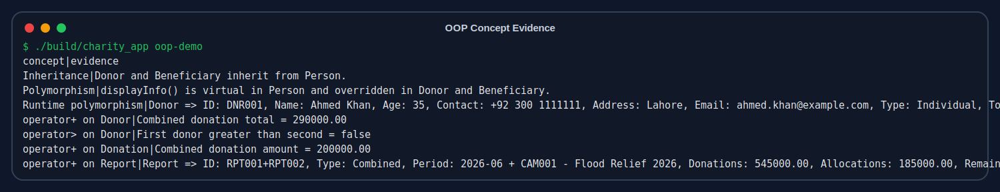
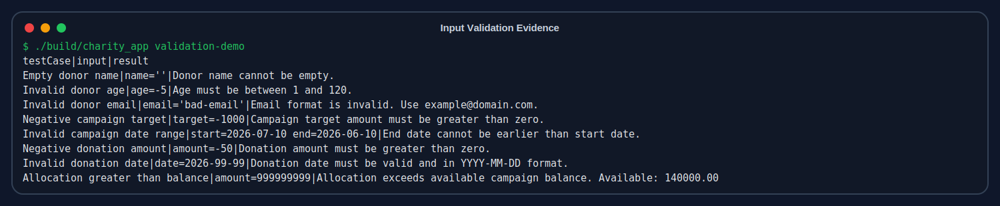
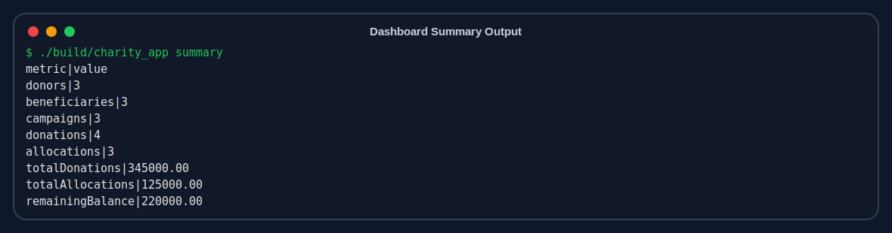
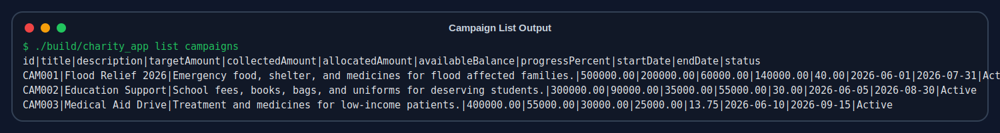

# Charity & Donation Management System — OOP Project Report

**Course:** Object-Oriented Programming (OOP)  
**Language:** C++  
**GUI:** Streamlit wrapper over C++ executable  
**Team Members:** Ali Raza (2540010), Muhammad Ammar (2540004), Taha Ali (2540008)  
**Project Type:** Management System  
**Submission Project:** Charity and Donation Management System

---

## 1. Problem Definition

Small charity organizations often manage donors, donations, beneficiaries, and campaign expenses using paper files or simple spreadsheets. This causes three major problems:

1. Donors cannot easily see where their money was used.
2. Charity staff can lose track of collected and distributed funds.
3. There is weak accountability because donation and allocation records are separated.

This project solves the problem by providing a structured system where every donor, campaign, donation, beneficiary, and fund allocation is stored and linked.

---

## 2. Proposed Solution

The Charity & Donation Management System is a C++ OOP application with a Streamlit GUI. The C++ core performs all important operations:

- CRUD operations
- input validation
- file handling
- report generation
- OOP demonstrations
- data consistency checks

Streamlit is used only as a GUI wrapper. It calls the C++ executable through Python `subprocess` and displays forms, tables, charts, and validation evidence.

This design gives the project an advanced interface while keeping the viva and main implementation focused on C++.

---

## 3. Tools and Technologies

| Area | Technology |
|---|---|
| Core Language | C++17 |
| GUI | Streamlit |
| Storage | Text files (`.txt`) |
| Build Tool | `g++`, `build_core.py`, `Makefile` |
| Documentation | Markdown, HTML, Mermaid/SVG UML |
| Version Control | GitHub-ready project structure |

---

## 4. System Design

The system is divided into two layers:

### 4.1 C++ OOP Core

The C++ core contains all business logic. It validates data and saves records in text files.

### 4.2 Streamlit GUI Layer

The Streamlit layer provides a user-friendly interface for:

- dashboard
- donor management
- campaign management
- beneficiary management
- donation recording
- fund allocation
- reports
- validation evidence
- OOP evidence

The GUI does not replace the C++ logic. It only passes inputs to the C++ executable.

---

## 5. UML Diagrams

### 5.1 UML Class Diagram


### 5.2 UML Use Case Diagram


Mermaid sources are also available in `docs/uml/class_diagram.mmd` and `docs/uml/use_case_diagram.mmd`.

---

## 6. Class Structure

| Class | Type | Responsibility |
|---|---|---|
| `Person` | Base class | Stores common identity fields: ID, name, age, contact, address |
| `Donor` | Derived class | Represents donors and tracks total donations |
| `Beneficiary` | Derived class | Represents aid receivers and tracks received support |
| `Campaign` | Core class | Tracks campaign target, collected amount, allocated amount, progress |
| `Donation` | Core class | Stores a single donation event |
| `FundAllocation` | Core class | Stores fund distribution to beneficiaries |
| `Report` | Summary class | Stores monthly/campaign-level summaries |
| `FileManager` | Utility class | Reads/writes all text-file data |
| `CharitySystem` | Controller class | Coordinates all operations and keeps records consistent |

---

## 7. OOP Concepts Implementation

| OOP Concept | Implementation |
|---|---|
| Classes and Objects | All entities are represented as classes and runtime objects |
| Encapsulation | Data members are private/protected with getters/setters |
| Inheritance | `Donor` and `Beneficiary` inherit from `Person` |
| Polymorphism | `displayInfo()` is virtual in `Person` and overridden in derived classes |
| Constructors | Default, parameterized, and overloaded constructors are used |
| Operator Overloading | `+`, `>`, `<` are overloaded in `Donor`, `Donation`, `Campaign`, `Report` |
| File Handling | `FileManager` manages `.txt` files |
| Object Relationships | Donations link donors and campaigns; allocations link beneficiaries and campaigns |

### OOP Evidence Output



Raw evidence file: `docs/evidence/oop_evidence.txt`

---

## 8. Functional Modules

### 8.1 Donor Management

- add donor
- update donor
- delete donor if no donation history exists
- view total donated amount

### 8.2 Campaign Management

- add campaign
- update campaign
- delete campaign if not linked to records
- view target, collected amount, allocated amount, available balance, and progress

### 8.3 Beneficiary Management

- add beneficiary
- update beneficiary
- delete beneficiary if no allocation history exists
- link beneficiary to campaign

### 8.4 Donation Recording

- record donation with donor ID, campaign ID, amount, date, method, and note
- update donor total and campaign collection automatically

### 8.5 Fund Allocation

- allocate funds to beneficiaries
- prevent over-allocation
- ensure beneficiary belongs to selected campaign

### 8.6 Report Generation

- monthly report
- campaign report
- records total donations, allocations, and remaining balance

---

## 9. Data Management

The system stores data in text files under the `data/` folder:

| File | Data Stored |
|---|---|
| `donors.txt` | Donor records |
| `beneficiaries.txt` | Beneficiary records |
| `campaigns.txt` | Campaign records |
| `donations.txt` | Donation records |
| `allocations.txt` | Fund allocation records |
| `reports.txt` | Generated reports |

The file format is pipe-delimited text. Example:

```text
DNR001|Ahmed Khan|35|+92 300 1111111|ahmed.khan@example.com|Lahore|Individual|75000.00
```

---

## 10. Input Validation

Validation is implemented in the C++ core, not only in the GUI. This ensures that even if the GUI is bypassed, invalid data is rejected.

### Validation Rules

| Input | Rule |
|---|---|
| Name/title/description | Cannot be empty |
| Age | Must be between 1 and 120 |
| Contact | Must contain 7 to 15 digits with valid phone characters |
| Email | Must match email pattern |
| Amount | Must be greater than zero |
| Date | Must be valid `YYYY-MM-DD` |
| Month | Must be valid `YYYY-MM` |
| Campaign date range | End date cannot be before start date |
| Fund allocation | Cannot exceed campaign available balance |
| Beneficiary allocation | Beneficiary must be linked to selected campaign |

### Validation Test Evidence



Raw validation evidence file: `docs/evidence/validation_evidence.txt`

---

## 11. Program Output Screenshots

### Dashboard Summary Output



### Campaign Table Output



The Streamlit GUI also shows these outputs as dashboard metrics, tables, and charts.

---

## 12. Testing Summary

A Python test script is included to test the C++ executable in an isolated temporary data folder:

```bash
python3 tests/run_core_tests.py
```

The tests verify:

- invalid donor name rejected
- invalid campaign target rejected
- demo data seeding works
- summary totals are correct
- negative donation rejected
- over-allocation rejected
- monthly report generation works
- OOP evidence command works

Test result:

```text
All C++ core tests passed.
```

---

## 13. Deployment and GUI

The GUI is implemented using Streamlit. To run locally:

```bash
pip install -r requirements.txt
streamlit run streamlit_app.py
```

The app can be deployed on Streamlit Community Cloud using GitHub. The repository contains:

- `requirements.txt` for Python dependencies
- `packages.txt` for Linux compiler package
- `streamlit_app.py` as the main app file

Note: Cloud local file storage may reset after redeployment, so the GUI includes a **Seed Demo Data** button. Local execution remains the best mode for demonstrating persistent text-file storage.

---

## 14. Innovation and Practical Usefulness

The project is more useful than a basic CRUD demo because it solves a real transparency issue:

- donors can be tracked
- campaigns show funding progress
- beneficiaries are linked to campaigns
- allocations cannot exceed available funds
- reports show money received, used, and remaining

This provides accountability for a small charity organization.

---

## 15. Conclusion

The Charity & Donation Management System successfully implements a complete C++ OOP project with a polished GUI wrapper. It includes meaningful classes, inheritance, polymorphism, constructors, operator overloading, file handling, CRUD operations, input validation, reports, UML diagrams, evidence outputs, and test cases.

The final design is suitable for viva because the main logic remains in C++, while Streamlit improves presentation and user experience.
