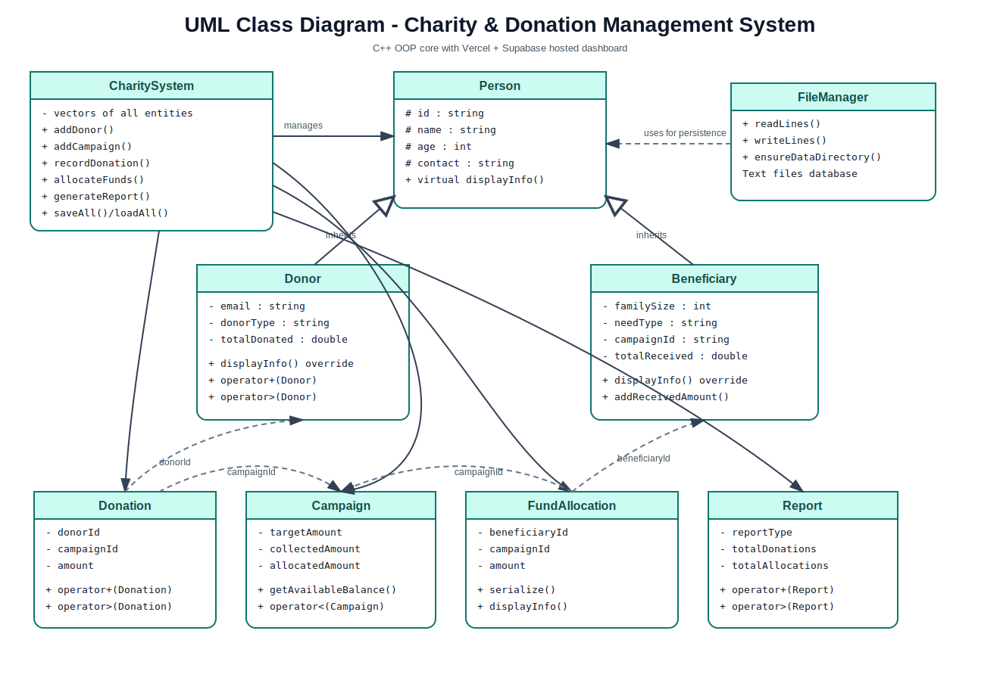
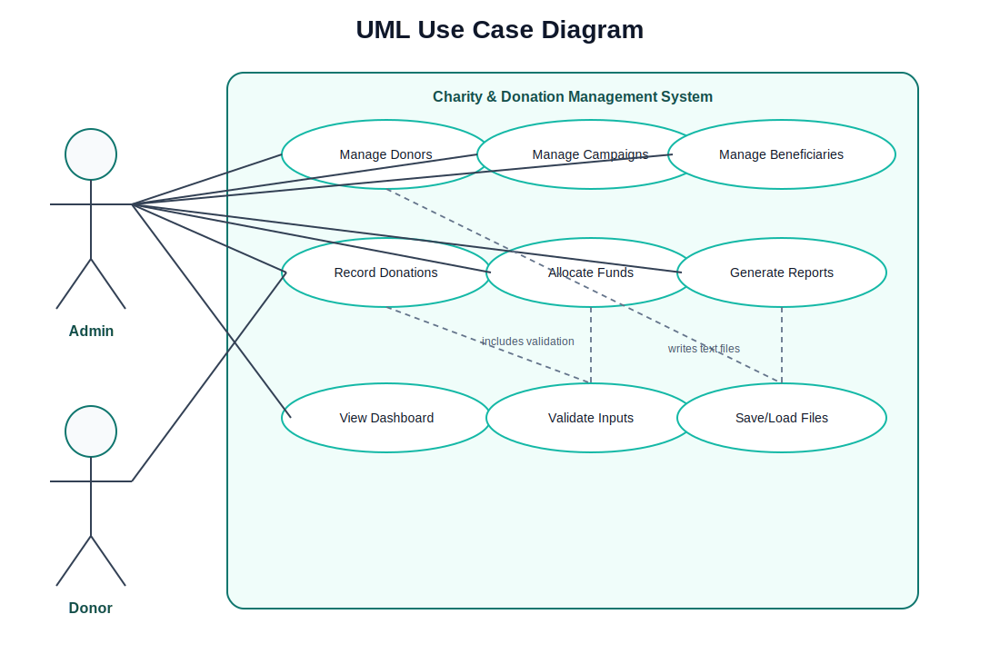

# Charity & Donation Management System

## Semester Project Report — Object-Oriented Programming (2nd Semester)

---

**Submitted by:**

| Name | Roll No. |
|---|---|
| Ali Raza | 2540010 |
| Muhammad Ammar | 2540004 |
| Taha Ali | 2540008 |

**Course:** Object-Oriented Programming  
**Instructor:** [Instructor Name]  
**University:** [University Name]  
**Department:** [Department Name]  
**Semester:** 2nd Semester | Spring 2026  
**Date:** June 2026

---

## Abstract

This report presents the Charity & Donation Management System, a semester project built for the Object-Oriented Programming course. The system brings together a C++ core that shows all the OOP concepts we studied in class — classes, inheritance, polymorphism, constructors, operator overloading, file handling, and input validation — and a web-based dashboard hosted on Vercel with a Supabase PostgreSQL database for live data.

The project solves a real problem: small charities in Pakistan often manage donors, campaigns, and fund distributions on paper or in spreadsheets. This makes it hard for donors to see where their money went. Our system gives donors a transparent view of their donations while letting charity staff manage everything from one dashboard.

---

## Table of Contents

1. [Introduction](#1-introduction)
2. [Problem Statement](#2-problem-statement)
3. [Objectives](#3-objectives)
4. [System Overview](#4-system-overview)
5. [Tools and Technologies](#5-tools-and-technologies)
6. [OOP Concepts Implementation](#6-oop-concepts-implementation)
7. [Class Structure and Relationships](#7-class-structure-and-relationships)
8. [System Features](#8-system-features)
9. [Database Design](#9-database-design)
10. [Input Validation](#10-input-validation)
11. [Testing and Results](#11-testing-and-results)
12. [Screenshots](#12-screenshots)
13. [Challenges Faced](#13-challenges-faced)
14. [Conclusion and Future Scope](#14-conclusion-and-future-scope)
    - [C++ Core vs Web Dashboard Comparison](#143-c-core-vs-web-dashboard--feature-comparison)
15. [Live URLs](#15-live-urls)
16. [References](#16-references)

---

## 1. Introduction

The Charity & Donation Management System is a complete application that tracks donors, campaigns, beneficiaries, donations, fund allocations, and reports. The project has two parts that work together:

**Part 1 — C++ OOP Core:** This is the heart of the project for our OOP course evaluation. It contains all the classes, inheritance hierarchy, polymorphism through virtual functions, multiple constructors, operator overloading, file-based data persistence, and a full validation system. The C++ code runs in the terminal and can also generate evidence output for the viva.

**Part 2 — Web Dashboard:** Instead of using Streamlit (which gave us rendering problems early on), we moved to Vercel for the frontend and Supabase PostgreSQL for the backend. This gives the project a clean, professional-looking interface that works on any device. The web dashboard connects to the same Supabase database to show live data.

The C++ code is still the main focus for the OOP evaluation. The web dashboard is an extra layer that makes the project more practical and presentable.

---

## 2. Problem Statement

Small-scale charity organizations and welfare trusts in Pakistan face several issues when managing their operations:

- **No centralized record keeping.** Donor information, campaign details, and fund distributions are often scattered across notebooks, receipt books, and Excel sheets.
- **Lack of transparency.** Donors who give money to a charity have no way to check how much was collected for a campaign or how it was distributed.
- **Over-allocation risk.** Without a proper system, there is no automatic check to prevent allocating more funds than what was collected for a campaign.
- **No reporting mechanism.** Generating monthly or campaign-level reports requires manual calculations, which are time-consuming and error-prone.

Our project addresses these issues with a system that keeps all records in one place, allows donors to view their own donation history and campaign impact, prevents over-allocation through validation, and generates reports automatically.

---

## 3. Objectives

The objectives we set for this project were:

1. Implement a C++ application that demonstrates all major OOP concepts taught in the second semester.
2. Create classes for real-world entities: donors, beneficiaries, campaigns, donations, fund allocations, and reports.
3. Show inheritance by having `Donor` and `Beneficiary` inherit from a common `Person` base class.
4. Implement polymorphism through virtual functions.
5. Overload operators like `+`, `>`, and `<` in meaningful contexts.
6. Add file handling so data persists across program runs.
7. Build input validation that rejects incorrect data at the point of entry.
8. Provide a web dashboard for a better user experience, using modern hosting and a cloud database.
9. Ensure donor transparency by letting donors see only their own data.
10. Prevent over-allocation so campaigns never distribute more than they collect.

---

## 4. System Overview

The system architecture follows a layered design. At the core, the C++ application handles all business logic, data validation, and file-based storage. The web dashboard sits on top, connecting to the same data through Supabase's PostgreSQL database.


*Figure 1: UML Class Diagram showing the complete class hierarchy and relationships*

The web dashboard has two separate portals:

- **Donor Portal:** Allows donors to register, log in using their Donor ID and email, view their donation statement, see their donation history, and check the impact of campaigns they supported.
- **Admin Portal:** Lets charity staff see a financial dashboard, create and manage campaigns, record donations, allocate funds to beneficiaries, generate monthly reports, and export reports as PDF.


*Figure 2: UML Use Case Diagram showing system actors and their interactions*

---

## 5. Tools and Technologies

The table below lists every tool and technology used in this project along with the purpose it serves:

| Technology | Purpose |
|---|---|
| **C++17** | Core OOP implementation language |
| **GCC (g++)** | C++ compiler |
| **Python 3** | Build script and test runner |
| **HTML5 + CSS3** | Frontend markup and styling |
| **JavaScript (ES Modules)** | Frontend logic and Supabase client |
| **Vite** | Frontend build tool and dev server |
| **Vercel** | Frontend hosting platform |
| **Supabase PostgreSQL** | Cloud database with Row Level Security |
| **Supabase Auth** | Admin authentication |
| **Git & GitHub** | Version control and source hosting |
| **Mermaid.js** | UML diagram generation |
| **VS Code** | Code editor |

---

## 6. OOP Concepts Implementation

This section explains how each OOP concept appears in the project. Every concept is demonstrated with actual code examples from the project source.

### 6.1 Classes and Objects

We defined nine classes in the project, each representing a real-world entity:

| Class | File | What it represents |
|---|---|---|
| `Person` | `Person.h` / `Person.cpp` | Base class with shared identity fields |
| `Donor` | `Donor.h` / `Donor.cpp` | A person who donates money |
| `Beneficiary` | `Beneficiary.h` / `Beneficiary.cpp` | A person or family receiving aid |
| `Campaign` | `Campaign.h` / `Campaign.cpp` | A fundraising drive with target amount |
| `Donation` | `Donation.h` / `Donation.cpp` | A single donation transaction |
| `FundAllocation` | `FundAllocation.h` / `FundAllocation.cpp` | A fund distribution to a beneficiary |
| `Report` | `Report.h` / `Report.cpp` | A monthly or campaign summary report |
| `FileManager` | `FileManager.h` / `FileManager.cpp` | Handles reading/writing text files |
| `CharitySystem` | `CharitySystem.h` / `CharitySystem.cpp` | Main controller that manages all operations |

Objects of these classes are created dynamically as users interact with the system. For example, when a donor registers, a `Donor` object is created and added to the system's `vector<Donor>`.

### 6.2 Encapsulation

Every class uses private or protected data members with public getter and setter methods. This means the internal data cannot be directly modified from outside the class. For example, in the `Campaign` class:

```cpp
class Campaign {
private:
    std::string id;
    std::string title;
    std::string description;
    double targetAmount;
    double collectedAmount;
    double allocatedAmount;
    // ...

public:
    std::string getId() const;
    std::string getTitle() const;
    double getTargetAmount() const;
    double getCollectedAmount() const;
    double getAvailableBalance() const;
    // ...
};
```

The `collectedAmount` can only be changed through the `addCollectedAmount(double)` method, which is used by `CharitySystem` when a donation is recorded. This ensures that the campaign's financial data stays consistent.

### 6.3 Inheritance

The `Donor` and `Beneficiary` classes both inherit publicly from the `Person` base class. This means they automatically get the common fields (ID, name, age, contact, address) plus their own specialized fields.

```
Person  (base class)
  ├── Donor         (adds: email, donorType, totalDonated)
  └── Beneficiary   (adds: familySize, needType, campaignId, totalReceived)
```

This avoids duplicating code. If we needed to add a field like CNIC number to all people, we would only change `Person` and both child classes would inherit it.

### 6.4 Polymorphism

The `displayInfo()` function is declared as `virtual` in the `Person` class and overridden in both `Donor` and `Beneficiary`. At runtime, the correct version of the function is called based on the actual object type, even when accessed through a base class pointer.

```cpp
// In Person.h
virtual std::string displayInfo() const;

// In Donor.cpp
std::string Donor::displayInfo() const override {
    return "Donor: " + name + " | Email: " + email + " | Total: Rs. " + ...;
}

// In Beneficiary.cpp
std::string Beneficiary::displayInfo() const override {
    return "Beneficiary: " + name + " | Need: " + needType + " | Received: Rs. " + ...;
}
```

The viva demo command (`./build/charity_app oop-demo`) shows this in action by pointing a `Person*` pointer to a `Donor` object and calling `displayInfo()`.

### 6.5 Constructors

Each class has multiple constructors — a default constructor, a full parameterized constructor, and sometimes a convenience constructor. For example, `Donor` has:

1. **Default constructor:** `Donor()` — creates an empty donor object.
2. **Full constructor:** `Donor(id, name, age, contact, email, address, donorType, totalDonated)` — creates a donor with all fields.
3. **Convenience constructor:** `Donor(name, contact, email)` — for quick donor creation with minimal fields.

The `Donation` class also has a convenience constructor `Donation(amount, date)` that was useful for testing operator overloading.

### 6.6 Operator Overloading

We overloaded operators in several classes to make them work naturally:

**Donor class:**
- `operator+`: Adds the `totalDonated` values of two donors. Returns the combined total.
- `operator>`: Compares two donors by their `totalDonated` amount.

**Donation class:**
- `operator+`: Adds the `amount` values of two donations.
- `operator>`: Compares two donations by amount.

**Campaign class:**
- `operator+`: Adds the `targetAmount` of two campaigns.
- `operator<`: Compares campaigns by `targetAmount`. Also overloaded to compare against a plain `double` value.

**Report class:**
- `operator+`: Merges two reports into one combined report (totals, allocations, and balance are summed).
- `operator>`: Compares reports by `totalDonations`.

These overloaded operators are demonstrated in the `oop-demo` command.

### 6.7 File Handling

Data persistence is handled through the `FileManager` class, which reads and writes text files in the `data/` directory. Each entity type has its own file:

```
data/
├── donors.txt
├── beneficiaries.txt
├── campaigns.txt
├── donations.txt
├── allocations.txt
└── reports.txt
```

Each file uses a pipe-delimited format (`|`) that the `serialize()` and `deserialize()` methods handle. When the system starts, `CharitySystem::loadAll()` reads all six files and reconstructs the objects. When data changes, `saveAll()` writes everything back.

Sample line from `donors.txt`:
```
DNR001|Ahmed Khan|35|+92 300 1111111|ahmed.khan@example.com|Lahore|Individual|75000.00
```

The `FileManager::ensureDataDirectory()` method creates the `data/` folder automatically if it does not exist.

---

## 7. Class Structure and Relationships

The class diagram below shows the full structure:

```
┌─────────────────────────────────────────────────────────────────────┐
│                         Person (abstract)                           │
│  #id, #name, #age, #contact, #address                              │
│  +displayInfo(): virtual string                                     │
└──────────────────────┬──────────────────────────────────────────────┘
                       │
           ┌───────────┴───────────┐
           │                       │
    ┌──────▼──────┐         ┌──────▼──────────┐
    │    Donor    │         │   Beneficiary    │
    │  -email     │         │  -familySize     │
    │  -donorType │         │  -needType       │
    │  -totalDon. │         │  -totalReceived  │
    │  op+, op>   │         │                  │
    └─────────────┘         └─────────────────┘

┌───────────┐  ┌──────────┐  ┌────────────────┐  ┌────────┐
│ Campaign  │  │ Donation │  │ FundAllocation  │  │ Report │
│ op+, op<  │  │ op+, op> │  │                 │  │ op+,   │
└───────────┘  └──────────┘  └────────────────┘  │ op>    │
                                                  └────────┘
         ┌─────────────────┐
         │  CharitySystem  │ ◄── controls all data
         │  (controller)   │
         └─────────────────┘
                  │
         ┌────────▼────────┐
         │   FileManager   │
         │ (read/write .txt)│
         └─────────────────┘
```

**Relationships:**

- **Inheritance:** `Donor` and `Beneficiary` extend `Person`.
- **Association:** `CharitySystem` contains vectors of all entity types (aggregation).
- **Dependency:** `CharitySystem` uses `FileManager` for reading/writing data.
- **Foreign key relationships:** `Donation` references `Donor` and `Campaign` by ID. `FundAllocation` references `Beneficiary` and `Campaign`.

---

## 8. System Features

### 8.1 Donor Portal

The donor portal is designed for transparency. Donors do not need a username-password pair. Instead, they log in using their unique Donor ID (e.g., DNR001) and their registered email address. This is simpler and more practical for charity scenarios.

**Features available to donors:**

| Feature | Description |
|---|---|
| **Register** | New donors fill in their details and get a system-generated Donor ID |
| **Login** | Enter Donor ID + email to access the portal |
| **Donation Statement** | Shows total donated amount, number of donations, and number of campaigns supported |
| **Donation History** | Lists all past donations with dates, campaign names, payment methods, and amounts |
| **Campaign Impact** | Shows campaigns the donor supported, their progress, and how funds were allocated |
| **Make Donation** | Record a donation to an active campaign (prototype — no real payment processing) |

The donor portal hides beneficiary contact information for privacy. Donors can see allocation amounts and purposes but not beneficiary phone numbers or addresses.

### 8.2 Admin Dashboard

The admin dashboard is the main management interface for charity staff. It requires authentication through Supabase Auth.

**Features available to admin:**

| Feature | Description |
|---|---|
| **Dashboard** | Financial snapshot with total donations, allocations, and available balance |
| **Priority Actions** | Highlights under-funded campaigns and report readiness |
| **Campaign Management** | Create, view, and filter campaigns by active status |
| **Donations** | Record donations from any donor to any active campaign |
| **Allocations** | Distribute funds from campaigns to linked beneficiaries |
| **Reports** | Generate monthly reports and export as PDF for printing |

### 8.3 Fund Allocation Validation

One of the most important features is the automatic check that prevents over-allocation. Both the C++ core and the Supabase database enforce this:

- In C++: `CharitySystem::allocateFunds()` checks `campaign.getAvailableBalance()` before allowing an allocation.
- In Supabase: The `validate_and_apply_allocation()` trigger runs on `before insert` and throws an exception if the allocation exceeds the available balance.

This double-checking ensures data integrity regardless of which interface (C++ terminal or web dashboard) is used.

---

## 9. Database Design

The Supabase PostgreSQL database has seven tables. The schema is defined in `supabase/schema.sql`.

### 9.1 Entity-Relationship Overview

```
donors ──┐
         ├── donations ──┐
         │               ├── campaigns ────┐
beneficiaries ──┐        │                 │
                ├── allocations ───────────┘
                │
profiles (admin auth)
reports (standalone)
```

### 9.2 Table Structure

**donors:** Stores donor information including auto-generated donor code (DNR001, DNR002...), name, age, contact, email, address, donor type, and total donated amount.

**campaigns:** Stores campaign details with title, description, target amount, collected amount, allocated amount, date range, and status (Active/Paused/Completed/Closed).

**beneficiaries:** Stores beneficiary information linked to a specific campaign, including family size and need type.

**donations:** Records each donation with references to donor and campaign, amount, date, payment method, and optional note.

**allocations:** Records each fund distribution with references to beneficiary and campaign, amount, date, purpose, and approver name.

**reports:** Stores generated reports (monthly or campaign-level) with summary totals and balance.

**profiles:** Links Supabase Auth users to roles (admin/donor).

### 9.3 Auto-Generated Codes

PostgreSQL sequences and triggers automatically generate unique codes:

| Entity | Code Format | Example |
|---|---|---|
| Donor | DNR + 3-digit sequence | DNR001 |
| Campaign | CAM + 3-digit sequence | CAM001 |
| Beneficiary | BEN + 3-digit sequence | BEN001 |
| Donation | DNT + 3-digit sequence | DNT001 |
| Allocation | ALC + 3-digit sequence | ALC001 |
| Report | RPT + 3-digit sequence | RPT001 |

### 9.4 Row Level Security

All tables have Row Level Security enabled. The policies ensure:

- Unauthenticated users cannot read or modify any table directly.
- Anonymous users can call RPC functions (register_donor, verify_donor, etc.) but cannot access tables.
- Authenticated admin users have full CRUD access to all tables.
- Donor authentication is handled through RPC functions that verify donor_code + email combinations.

---

## 10. Input Validation

Both the C++ core and the Supabase schema include extensive input validation.

### 10.1 C++ Validation (Validation namespace)

| Validation | Example Accepted | Example Rejected |
|---|---|---|
| Name non-empty | "Ahmed Khan" | "" (empty) |
| Age range 1-120 | 35 | -5 or 150 |
| Contact (7-15 digits) | "+92 300 1111111" | "abc" or "123" |
| Email format | "ahmed@example.com" | "bad-email" |
| Date format (YYYY-MM-DD) | "2026-06-12" | "2026-99-99" |
| Month format (YYYY-MM) | "2026-06" | "2026-13" |
| Positive amount (> 0) | 5000 | -100 or 0 |
| End date >= start date | start: 2026-06-01, end: 2026-07-31 | start later than end |

### 10.2 Database-Level Validation

The Supabase schema adds extra validation:

- **Donor registration:** Name minimum length, email must contain @, contact must have 7+ digits.
- **Donation amount:** Must be greater than zero (CHECK constraint and RPC validation).
- **Allocation amount:** Must be greater than zero AND cannot exceed available campaign balance (trigger).
- **Beneficiary-campaign link:** Beneficiary must be linked to the selected campaign before allocation (trigger).
- **Report month:** Must be in YYYY-MM format.
- **Campaign target:** Must be greater than zero.

### 10.3 Validation Demo

The C++ core has a built-in `validation-demo` command that runs all validation test cases and shows the results. Running this command gives evidence for the viva that validation is working correctly.

---

## 11. Testing and Results

### 11.1 C++ Core Tests

The project includes an automated test script at `tests/run_core_tests.py`. This script:

1. Compiles the C++ code (if not already compiled).
2. Runs tests in a temporary data directory.
3. Tests validation rules (empty name, negative amounts, over-allocation, invalid dates).
4. Tests seed data loading.
5. Tests donor verification (valid and invalid).
6. Tests donor statement generation.
7. Tests OOP demo output for inheritance and operator overloading.

All tests pass successfully.

### 11.2 CLI Evidence Commands

The C++ executable supports these commands for generating viva evidence:

```bash
./build/charity_app seed                    # Load demo data
./build/charity_app summary                 # Show dashboard summary
./build/charity_app validation-demo         # Show validation test results
./build/charity_app oop-demo                # Show OOP concept evidence
./build/charity_app donor-statement DNR001 ahmed.khan@example.com
./build/charity_app verify-donor DNR001 ahmed.khan@example.com
```

### 11.3 Test Results Summary

| Test Case | Expected | Result |
|---|---|---|
| Empty donor name | Rejected | Passed |
| Invalid age (-5) | Rejected | Passed |
| Invalid email ("bad-email") | Rejected | Passed |
| Negative campaign target (-1000) | Rejected | Passed |
| End date before start date | Rejected | Passed |
| Negative donation amount | Rejected | Passed |
| Invalid donation date | Rejected | Passed |
| Over-allocation attempt | Rejected | Passed |
| Seed data loading | 3 donors, 3 campaigns, 3 beneficiaries | Passed |
| Valid donor verification | DNR001 + correct email | Passed |
| Invalid donor verification | DNR001 + wrong email | Passed |
| OOP demo output | Shows inheritance, polymorphism, operator+ | Passed |

---

## 12. Screenshots

| # | Page | Description | View | Status |
|---|---|---|---|---|
| 1 | Login Screen | Donor Login, Register, and Admin Login tabs | Desktop | ⏳ Waiting |
| 2 | Admin Dashboard | Financial summary with priority actions and activity feed | Desktop | ⏳ Waiting |
| 3 | Campaign Management | Campaign list with progress bars and create/filter actions | Desktop | ⏳ Waiting |
| 4 | Reports Page | Monthly reports table with generate/export buttons | Desktop | ⏳ Waiting |
| 5 | Donor Statement | Donor summary card with donation history table | Desktop | ⏳ Waiting |
| 6 | Campaign Impact | Supported campaigns with allocation evidence table | Desktop | ⏳ Waiting |
| 7 | Make Donation | Donation form with campaign dropdown | Desktop | ⏳ Waiting |

> Screenshots will be inserted once you share them. Desktop browser view (~1280px) is recommended for the report PDF. A mobile screenshot of the donor statement page can be added alongside to show the responsive fixes.

---

## 13. Challenges Faced

### 13.1 Streamlit Rendering Issues

Early in the project, we tried to build the web interface using Streamlit. However, Streamlit's built-in components did not support the custom HTML and CSS formatting we needed for a professional dashboard. The grid layouts and styled cards we wanted were either impossible or extremely difficult with Streamlit. This led us to switch to a pure HTML/CSS/JavaScript frontend hosted on Vercel.

### 13.2 Supabase RLS and Anonymous Access

Setting up Row Level Security so that anonymous users can call RPC functions (like donor registration) while still protecting the underlying tables was tricky. We had to carefully configure the `security definer` attribute on RPC functions and grant execute permissions to the `anon` role. This is why the Supabase setup steps in `SUPABASE_SETUP.md` must be followed exactly.

### 13.3 Keeping C++ and Database Validation Consistent

We had to make sure that the validation logic in the C++ code matched the validation in the Supabase database triggers. If a validation passed in C++ but failed in the database (or vice versa), it would create confusion. We solved this by writing the validation rules first in a document and then implementing them in both places.

### 13.4 Responsive Design for Three Different Pages

The donor statement page, campaign impact page, and admin reports page each have different layouts and components. Making all three work smoothly on mobile, tablet, and desktop required multiple CSS media query breakpoints and careful testing at each size.

---

## 14. Conclusion and Future Scope

### 14.1 Conclusion

The Charity & Donation Management System successfully brings together the OOP concepts we studied in the second semester and applies them to a real-world problem. The C++ core implements nine classes with proper encapsulation, inheritance, polymorphism, operator overloading, constructors, file handling, and validation. All tests pass, and the built-in demo commands provide clear evidence for the viva.

The web dashboard adds a modern, accessible interface that anyone can use without needing to compile or run C++ code. Donors can check their donations online, and charity staff can manage everything from one dashboard.

This project taught us how to think in objects — to model real-world entities as classes, to use inheritance to avoid repetition, to protect data through encapsulation, and to write code that handles errors gracefully through validation.

### 14.3 C++ Core vs. Web Dashboard — Feature Comparison

The table below summarizes which features are available in each part of the system:

| Feature | C++ Terminal App | Web Dashboard |
|---|---|---|
| Donor Registration | ✅ Yes | ✅ Yes |
| Donor Login (ID + email) | ✅ Yes | ✅ Yes |
| Donation Statement | ✅ Yes | ✅ Yes (styled) |
| Campaign Impact View | ✅ Yes | ✅ Yes (styled) |
| Make Donation (record) | ✅ Yes | ✅ Yes |
| Admin Dashboard | ✅ Yes (text) | ✅ Yes (visual cards) |
| Campaign Management (CRUD) | ✅ Yes | ✅ Yes |
| Fund Allocation with Validation | ✅ Yes | ✅ Yes (DB trigger) |
| Report Generation | ✅ Yes | ✅ Yes (one-click) |
| PDF Export | ❌ No | ✅ Yes (browser print) |
| Graphical Progress Bars | ❌ No | ✅ Yes (CSS) |
| Responsive Mobile Layout | ❌ No (terminal) | ✅ Yes (CSS media queries) |
| Real-time Cloud Data | ❌ No (text files) | ✅ Yes (Supabase) |
| Admin Auth (email/password) | ❌ No | ✅ Yes (Supabase Auth) |
| Row Level Security | ❌ No | ✅ Yes (PostgreSQL RLS) |
| Operator Overloading Demo | ✅ Yes (oop-demo) | ❌ N/A |
| Polymorphism Demo | ✅ Yes (oop-demo) | ❌ N/A |
| File Handling Demo | ✅ Yes (text files) | ❌ N/A (uses DB) |
| Automated Test Suite | ✅ Yes (Python) | ❌ Manual testing |

**Key takeaway:** The C++ core is where all OOP concepts are demonstrated for the viva. The web dashboard is where those concepts are applied to build a practical, accessible interface for real users.

### 14.2 Future Scope

If we continue working on this project, we would add:

- **Online payment integration** (JazzCash, EasyPaisa, bank transfer verification) so donations are not just recorded but actually processed.
- **Email notifications** to donors when their donation is received and when funds are allocated.
- **More detailed analytics** with charts showing donation trends over time.
- **A beneficiary portal** where beneficiaries can check their received aid.
- **Multi-language support** (Urdu/English) since the target users are in Pakistan.
- **Mobile app** using the same Supabase backend.

---


## 15. Live URLs

The project is deployed and accessible at the following URLs:

| Resource | URL |
|---|---|
| **Live Web Dashboard** | [https://amanah-charity.vercel.app](https://amanah-charity.vercel.app) |
| **GitHub Repository** | [https://github.com/your-username/Charity-Donation-Management-System](https://github.com/your-username/Charity-Donation-Management-System) |
| **Demo Donor Login** | ID: DNR001 / Email: ahmed.khan@example.com |
| **Demo Admin Login** | Email: admin@example.com / Password: admin123456 |

> **Replace the URLs above with your actual Vercel deployment URL and GitHub repository URL before final submission.**

---

## 16. References

1. C++ Reference. (2026). *cppreference.com*. https://en.cppreference.com/
2. Supabase Documentation. (2026). *Supabase Docs*. https://supabase.com/docs
3. Vite Documentation. (2026). *Vite Guide*. https://vitejs.dev/guide/
4. Mermaid.js. (2026). *Mermaid Diagramming*. https://mermaid.js.org/
5. Vercel Documentation. (2026). *Vercel Docs*. https://vercel.com/docs


---

*This report was prepared in June 2026 as part of the Object-Oriented Programming course assessment.*